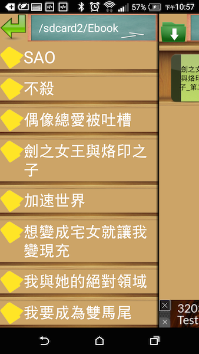
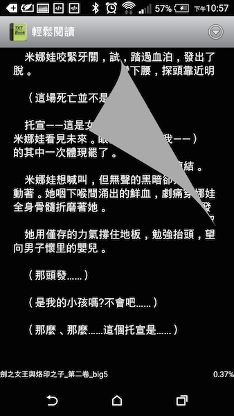

## 聲明
---
### 本作品只提供研究和研討之用途使用,不提供任何營利用途之使用.
## 簡介
---
### 主要想實現滑開快速加入TXT文件檔,並實現基本的閱讀和書簽功能.

 
## 使用
---
### 利用 git clone ,再使用Android Studio用open an existing Android Studio project開啓專案。
##參考
---
### [android-menudrawer](https://github.com/SimonVT/android-menudrawer)
### [android-ColorPickerPreference](https://github.com/attenzione/android-ColorPickerPreference)
   
   
   
